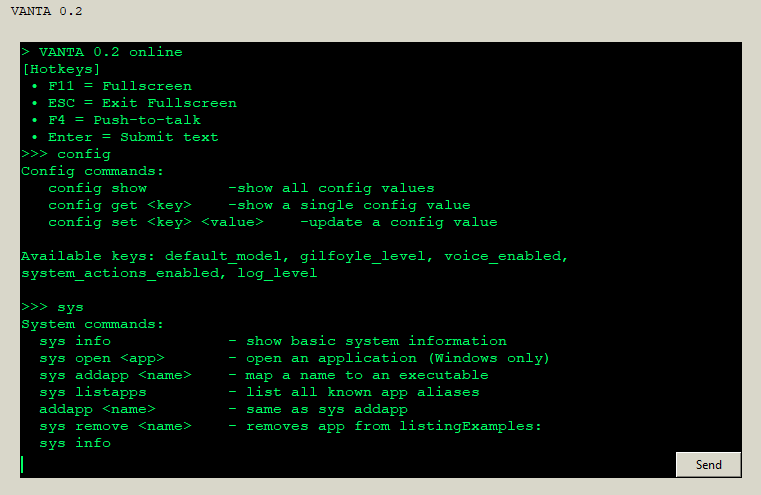

# Vanta — Local AI Voice Assistant (Development Build 0.2)

Vanta is a Python-based voice and text assistant built with real-time speech processing, a Tkinter desktop interface, and a multi-threaded audio pipeline that keeps the UI responsive while handling microphone input and AI requests. It is designed to function as a practical productivity tool capable of controlling applications, responding conversationally, and eventually assisting with code understanding and modification.

The long-term goal is to develop Vanta into a local AI development assistant with the ability to read, analyze, and safely edit code. This is an ongoing personal engineering project built publicly for learning, improvement, and transparency.

---

## Features (v0.2)

- Push-to-talk global hotkey (F4)
- Real-time speech-to-text transcription
- Tkinter GUI with live output history
- Threaded audio pipeline to prevent UI freezing
- Natural-language system commands: open / launch / start applications
- Alias system for application shortcuts: addapp, removeapp, listapps
- Persistent JSON config storage
- PyInstaller executable packaging support
- Modular architecture for clean expansion

---

## Project Structure

vanta/
  gui/        - GUI event handling and interface
  audio/      - microphone capture, buffering, streaming
  core/       - main logic, routing, configuration
  commands/   - system/alias command execution
  assets/     - UI assets and audio (future)
  .venv/      - virtual environment (ignored by git)

Key modules:
  vanta_gui.py   — main application and GUI layer
  audio_io.py    — audio pipeline and recording
  assistant.py   — AI response handling and prompting
  brain.py       — routes input to chat or commands
  system.py      — system-level actions and app launching
  config.py      — persistence and alias storage

---

## Requirements

- Windows 10/11
- Python 3.12
- Microphone enabled
- OpenAI API key

---

## Installation & Setup

git clone https://github.com/lumberhoon/vanta.git
cd vanta
py -3.12 -m venv .venv
.\.venv\Scripts\activate
pip install -r requirements.txt

---

## API Key Setup

Create a `.env` file in the project root and add:

OPENAI_API_KEY="your_api_key_here"

You can generate your key at: https://platform.openai.com

---

## Running the Application

python vanta_gui.py

---

## Roadmap

### v0.3 (Current Development)
- `code` command namespace (`code read`, `code explain`, safe `.bak` backups`)
- Voice UI indicators and ping audio feedback
- Improved GUI formatting and output display
- API key configuration flow
- Basic conversation memory (short-session retention)

### v0.4
- System tray mode for background running
- Global performance overlay (CPU / RAM / temperature)
- Session history and log viewer
- Persistent conversational memory
- Automated code fix & patch suggestions
- VS Code extension integration
- Workflow automation commands

---

## Example Commands

open chrome  
addapp valorant C:\Riot\Valorant.exe  
listapps  
chat what time is it  
Press F4 to activate voice mode

---

## Screenshot

---

## About

Built by Daniel Lee (20).  
Learning software engineering and building publicly to develop real-world engineering skills through hands-on projects.

GitHub: https://github.com/lumberhoon